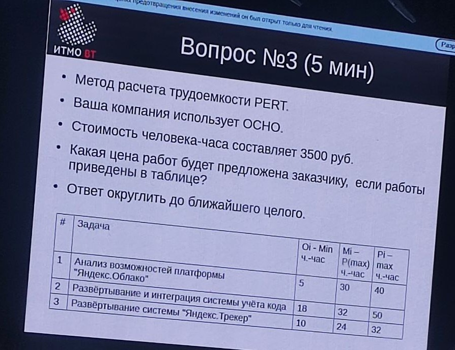

# ЭПИ

- [Лабораторная работа 1](Lab1/Lab1_Юнусов_Лапин.pdf)
- [Лабораторная работа 2](Lab2/Lab2_Юнусов_Лапин.pdf)
- [Лабораторная работа 3](Lab3/Lab3_Юнусов_Лапин.pdf)

## Рубежка

> Подсчитайте стоимость Вашего ПО без НДС, если в бюджет вы заплатили НДС на сумму 17 800 руб, и:
> - Вы и ваши подрядчики используют общую систему налогообложения
> - Вы воспользовались услугами других компаний и получили счета-фактуры с наличием НДС:
>	- ООО «Белое и пушистое» на 32 000 руб. - эта цена приведена без НДС.
>	- ООО «Балтийские боевые слоны» на 86 400 руб - эта цена включает НДС.

    
Решение

1. **Первая компания**:
   - **Расходы без НДС**: 32 000 рублей
   - **Стоимость без НДС (но она его все равно заплатила)**: 
     - **Входящий НДС**: 32 000 × 0.2 = 6 400 рублей
2. **Вторая компания**:
   - **Расходы с НДС**: 86 400 рублей
   - **НДС включен в стоимость**: 
     - **База без НДС**: 86 400 ÷ 1.20 = 72 000 рублей
     - **Входящий НДС**: 86 400 - 72 000 = 14 400 рублей

3. **Расчёт НДС к уплате**
    - X × 0.2 = 6 400 + 14 400 + 17 800 = 38 600 рублей
    - X = 38 600 ÷ 0.2 = 193 000 рублей

### Ответ

$\fbox{193 000 рублей}$

> - Вы разработали ПО за 7 спринтов, как показывает ваша финальная улучшенная диаграмма сгорания.
> - За спринт разработчики отрабатывают 80 попугаев.
>   - после первого спринта в бэклог было добавлено 20 попугаев,
>   - второго 40,
>   - третьего 70,
>   - а затем в каждый следующий спринт добавлялось по 10 попугаев.
> - Сколько попугаев было изначально в улучшенной диаграмме сгорания?

    
Решение

1. Общее количество выполненных задач за 7 спринтов:
`7 × 80 = 560`
1. Добавленные задачи после каждого спринта:
> «Все попугаи, я говорил на лекции, не могут накидываться никак иначе, кроме как перед спринтом в текущий спринт»
> © Клименков С.В.

|№|Добавлено|
|---|---|
|1| 20 |
|2| 40 |
|3| 70 |
|4| 10 |
|5| 10 |
|6| 10 |
|7| 0 |
|Итого|160|
1. Начальный бэклог:
`560 - 160 = 400`

### Ответ

$\fbox{400}$

    
Решение

| $O_i$ | $M_i$ | $P_i$ | $E_i$ | $СКО_i$ | $СКО_i^2$ |
|---|---|---|---|---|---|
| $5$ | $30$ | $40$ | $\frac{55}{2}$ | $\frac{35}{6}$ | $\frac{1225}{36}$ |
| $18$ | $32$ | $50$ | $\frac{98}{3}$ | $\frac{16}{3}$ | $\frac{256}{9}$ |
| $10$ | $24$ | $32$ | $23$ | $\frac{11}{3}$ | $\frac{121}{9}$ |

$\sum E_i = \frac{499}{6}$

$СКО^2 = \sqrt{\frac{1225}{36} + \frac{256}{9} + \frac{121}{9}} = 8.71$

$E_{95} = \frac{499}{6} + 2 \cdot 8.71 = 100.6$

Цена без НДС = $100.6 \cdot 3500 = 352074.4529 руб$

Цена с НДС = $100.6 \cdot 1.2 = 422489.3435 руб$

### Ответ

$\fbox{422 489 руб}$

> - Между Сторонами заключен договор, где Исполнитель обязан изготовить ПО, стоимость которого составляет 1 200 000 руб. Без НДС, Исполнитель на УСН. Заказчик заплатил задаток 300 000 руб.
> - Договор может быть расторгнут за неисполнение любой из Сторон существенных условий Договора, если просрочка разработки ПО
Исполнителем составило 20 и более календарных
> - В неустойке по договору за неисполнение обязательств
Исполнителем предусмотрено пени за просрочку сдачи ПО за каждый календарный день просрочки на 0.05% от суммы договора, но не более 10% от суммы договора, а также штраф 50000 руб.
> - Расторжение договора не избавляет стороны от уплаты неустойки.
> - Какую сумму должен выплатить Исполнитель Заказчику, если
Заказчик расторгает договор за неисполнение Исполнителя после
20 дня просрочки обязательств?

    
Решение

- Всего `1 200 000 руб`
- Задаток `300 00 руб` (Задаток возвращается в двойном размере ([Лекция 6](https://www.youtube.com/watch?v=oq5hT2W4swM&list=PLBWafxh1dFuy5v7wAueiVTuIiroN4TZAo&index=7&t=1h19m31s)))
- Штраф `50 000 руб`
- Просрок `20`
- Пени `1 200 000 × 0.05% = 600 руб/день`
    - Всего `600 × 20 = 12000 руб`, что меньше 10%.
- Итого `300 000 × 2 + 12 000 + 50 000 руб = 662 000 руб`

### Ответ

$\fbox{662 000 руб}$

> - Вы директор ООО на общей системе налогообложения. Вы хотите выплатить работнику на руки 84 617.18 руб.
> - Сколько рублей вы должны включить в счет заказчику, если социальные налоги совокупно составляют 8.1%? (округлить до целых рублей)
> - Современные требования налоговой для налогов, включенные в 1 МРОТ заработной платы не учитывать. (т. е. чистый расчет).

    
Решение

- Счет: `84 617.18 ÷ 0.87 × 1.081 × 1.2 = 126 167.1332 руб`

### Ответ

$\fbox{126 167 руб}$

## Рубежка (По вопросам от [RedGry](https://github.com/RedGry/ITMO/tree/master/Economics%20Software%20Engineering))

> Мы решили произвести товар стоимость которого составляет 300к, система налогообложения общая у нас. Мы используем 2 компании для производства нашего товара. В одной 72к траты без НДС, во второй 48к с НДС. Сколько мы должны уплатить НДС за наш товар?

    
Решение

Для расчёта НДС, который необходимо уплатить при продаже товара стоимостью 300 000 рублей на общей системе налогообложения, нужно учитывать как исходящий НДС (от продаж), так и входящий НДС (от расходов).

**Шаг 1: Определение исходящего НДС (от продажи)**

- **Продажная цена без НДС**: 300 000 рублей
- **Ставка НДС**: 20%
- **Исходящий НДС**: 300 000 × 20% = 60 000 рублей

**Шаг 2: Определение входящего НДС (от расходов)**

1. **Первая компания**:
   - **Расходы без НДС**: 72 000 рублей
   - **Стоимость без НДС (но она его все равно заплатила)**: 
     - **Входящий НДС**: 72 000 × 0.2 = 14 400 рублей

2. **Вторая компания**:
   - **Расходы с НДС**: 48 000 рублей
   - **НДС включен в стоимость**: 
     - **База без НДС**: 48 000 ÷ 1.20 = 40 000 рублей
     - **Входящий НДС**: 48 000 - 40 000 = 8 000 рублей

**Шаг 3: Расчёт НДС к уплате**

- **НДС к уплате** = **Исходящий НДС** - **Входящий НДС** = 60 000 - 8 000 - 14 400= **37 600 рублей**

### Ответ

$\fbox{37 600 рублей}$

> Трудоемкость разработки ПО составляет 300 попугаев в бэклоге. За спринт разработчики отрабатывают 50 попугаев. После первого спринта в бэклог было добавлено 20 попугаев, второго 40, третьего 70, а затем в каждый следующий спринт добавлялось по 10 попугаев. За сколько спринтов, в соответствии с улучшенной диаграммой сгорания, будет разработано ПО?

    
Решение

Чтобы определить, за сколько спринтов будет разработано ПО с учетом добавления новых попугаев в бэклог после каждого спринта, рассмотрим процесс пошагово.

### Исходные данные

- **Начальный бэклог:** 300 попугаев
- **Скорость разработки:** 50 попугаев за спринт
- **Добавления в бэклог:**
  - После 1-го спринта: +20 попугаев
  - После 2-го спринта: +40 попугаев
  - После 3-го спринта: +70 попугаев
  - Начиная с 4-го спринта и далее: +10 попугаев после каждого спринта

### Пошаговый расчет

| Спринт | Начальный бэклог | Разработано | Остаток до добавления | Добавлено | Итоговый бэклог |
|--------|-------------------|-------------|------------------------|-----------|------------------|
| 1      | 300               | 50          | 250                    | +20       | 270              |
| 2      | 270               | 50          | 220                    | +40       | 260              |
| 3      | 260               | 50          | 210                    | +70       | 280              |
| 4      | 280               | 50          | 230                    | +10       | 240              |
| 5      | 240               | 50          | 190                    | +10       | 200              |
| 6      | 200               | 50          | 150                    | +10       | 160              |
| 7      | 160               | 50          | 110                    | +10       | 120              |
| 8      | 120               | 50          | 70                     | +10       | 80               |
| 9      | 80                | 50          | 30                     | +10       | 40               |
| 10     | 40                | 40          | 0                      | —         | 0                |

### Подробное объяснение

1. **Спринты 1-3:** На начальных этапах добавление попугаев увеличается значительными плюсами (20, 40, 70 попугаев соответственно).
2. **Спринты 4 и далее:** Добавление стабилизируется на уровне 10 попугаев за спринт.
3. **Итого:** К 10-му спринту весь бэклог будет успешно отработан, и ПО будет завершено.

### Ответ

$\fbox{10 спринтов}$

> Дана таблица со значениями.
Необходимо посчитать по методу PERT $E_{0.95}$

| Параметр   | Оптимистичное (O) | Пессимистичное (P) | Наиболее вероятное (M) |  
|------------|--------------------|---------------------|------------------------|
| **E1**     | 24                | 40                 | 24                    |
| **E2**     | 16                | 40                 | 12                    |
| **E3**     | 16                | 44                 | 14                    |

    
Решение

---
$E_1 = \frac{24+40+4\cdot 24}{6}= \frac{80}{3}$

$E_2 = \frac{16+40+4\cdot 12}{6}= \frac{52}{3}$

$E_3 = \frac{16+44+4\cdot 14}{6}= \frac{58}{3}$

$E = \frac{80}{3} + \frac{52}{3} + \frac{58}{3} = \frac{190}{3}$

---
$СКО_1 = \frac{40-24}{6}=\frac{8}{3}$

$СКО_2 = \frac{40-16}{6}=4$

$СКО_3 = \frac{44-16}{6}=\frac{14}{3}$

$СКО = \sqrt{СКО_1^2 + СКО_2^2 + СКО_3^2} = \frac{2\sqrt{101}}{3}$

---

$E_{0.95} = E + 2\cdot СКО = \frac{190}{3} + 2\cdot \frac{2\sqrt{101}}{3} = 76.73$

### Ответ

$\fbox{77}$

> - Между Сторонами заключен договор, где Исполнитель обязан изготовить ПО, стоимость которого составляет `1 000 000 руб`. Заказчик заплатил задаток `200 000 руб`.
> - Договор может быть расторгнут за неисполнение любой из Сторон существенных условий Договора, если просрочка разработки ПО Исполнителем составило `20` и более календарных дней с возвратом обеспечительных обязательств.
> - В штрафных санкциях по договору за неисполнение обязательств Исполнителем предусмотрено пени за просрочку сдачи ПО за каждый календарный день просрочки на `0.5%` от суммы договора, но не более `10%` от суммы договора.
> - Расторжение договора не избавляет стороны от уплаты штрафов.
> - Какую сумму должен выплатить Исполнитель Заказчику, если Заказчик расторгает договор за неисполнение Исполнителя после `30 дня` просрочки обязательств?

    
Решение

Разберёмся по шагам:

1) Базовая сумма договора: 1 000 000 руб.  
2) Задаток (или иное обеспечительное обязательство), уплаченный Заказчиком Исполнителю: 200 000 руб.

   Задаток возвращается в двойном размере ([Лекция 6](https://www.youtube.com/watch?v=oq5hT2W4swM&list=PLBWafxh1dFuy5v7wAueiVTuIiroN4TZAo&index=7&t=1h19m31s)) = 400 000 руб.
4) Штрафные санкции по договору: 0,5 % в день от суммы договора за просрочку, но не более 10 % от суммы всего договора.  
   • 0,5 % от 1 000 000 руб. = 5 000 руб. в день  
   • За 30 дней просрочки «чистая» неустойка составила бы 30 × 5 000 = 150 000 руб.,  
     однако по условию договора максимум — 10 %, то есть 100 000 руб.  
5) Возможность расторжения при просрочке ≥ 20 дней с возвратом обеспечительных обязательств означает, что Исполнитель обязан вернуть задаток (200 000 руб.) и уплатить начисленную неустойку (100 000 руб.).  
6) Итого Исполнитель должен выплатить Заказчику:  
   $ 400000 руб$. (возврат задатка)  
   $+ 100000 руб$. (штраф за просрочку, ограниченный 10 %)  
   $= 500000 руб$.
### Ответ

$\fbox{500 000 руб}$

> Зарплата после всех налогов `40002 руб`. Налог на Фонды = `28.5%`. Необходимо было посчитать сколько было изначально (с налогами).

    
Решение

    
Подробно:

Шаг 1. Определяем «грязную» заработную плату (базу для НДФЛ)
Чистая зарплата = 40002 руб

Чистая зарплата = Грязная зарплата × (1 – 13%)

40 002 = Грязная зарплата × 0,87

Отсюда
Грязная зарплата = 40 002 / 0,87 ≈ 45 979,31 руб.

Шаг 2. Рассчитываем страховые взносы (28.5% от «грязной»)

Взносы в фонды = 45 979,31 × 0,285 ≈ 13104,10 руб.

Грязная зарплата + Взносы в фонды = 45 979,3 + 13104,10 ≈ 59083,41 руб

Шаг 3. Рассчитываем НДС (20%)

НДС = 59083,41 × 0,2 ≈ 11816,68 руб

Итого:

Грязная зарплата + Взносы в фонды + НДС = 59083,41 + 11816,68 ≈ 70900 руб

    
Коротко:

Изначально = (40002 / 0,87) × 1.285 × 1.2 = 70900 руб

### Ответ

$\fbox{70900 руб}$

## Перепись рубежки

Возможные темы -- https://aalexuser.github.io/Software-engineering-economics
